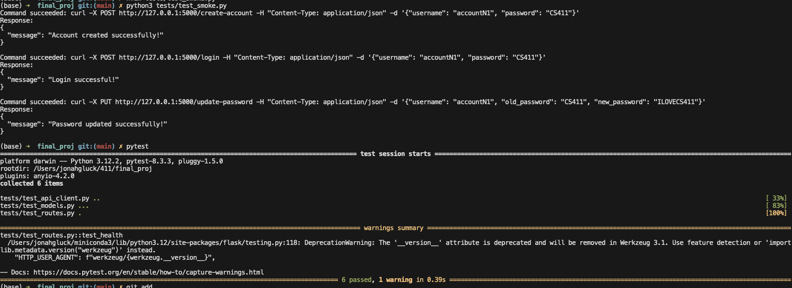

# Spotify-like Web Application

## Description
This is a Flask-based web application that provides Spotify-like functionality for managing user accounts, playlists, and interacting with Spotify's API to search for tracks. Users can create accounts, create playlists, add tracks, and search for songs using the Spotify API (a Spotify api key is required for interacting with the Spotify routes).

## Features
- **User Account Management**: Create accounts, login, and update passwords.
- **Playlist Management**: Create, view, update, and delete playlists.
- **Track Management**: Search tracks from Spotify's API and add them to playlists.

## Getting Started

### Prerequisites
- Python 3.9 or above
- Docker (Optional, for containerization)

### Installation

1. **Clone the Repository**:
   ```sh
   git clone <repo_url>
   cd 411-final-project
   ```

2. **Set Up Environment**:
   * Install dependencies:
   ```sh
   python -m venv venv
   source venv/bin/activate  # On Windows, use `venv\Scripts\activate`
   pip install -r requirements.txt
   ```

3. **Configure Environment Variables**:
   * Create a `.env` file in the project root:
   ```
   SPOTIFY_ACCESS_TOKEN=your_spotify_api_token
   SECRET_KEY=your_flask_secret_key
   ```

4. **Initialize Database**:
Remove any existing db under the ``instance`` directory. Then recreate the db with the same name ``spotify.db`` under that directory.

``instance/spotify.db`` should now exist.

6. **Run the Application**:
   ```sh
   python3 run.py
   ```

### Running with Docker
1. Build the Docker image:
   ```sh
   docker build -t spotify-like-app .
   ```

2. Run the container:
   ```sh
   docker run -p 5000:5000 spotify-like-app
   ```

## Testing
Run tests using pytest:
```sh
pytest
```
Smoke test and pytest tests passing


## Technologies
- Flask
- SQLAlchemy
- Spotify Web API
- Docker
- Pytest

## Example Curl Commands

### Create Accounts
```bash
curl -X POST http://127.0.0.1:5000/create-account -H "Content-Type: application/json" -d '{"username": "accountN1", "password": "CS411"}'
```

### Log In
```bash
curl -X POST http://127.0.0.1:5000/login -H "Content-Type: application/json" -d '{"username": "accountN1", "password": "CS411"}'
```

### Update Password
```bash
curl -X PUT http://127.0.0.1:5000/update-password -H "Content-Type: application/json" -d '{"username": "accountN1", "old_password": "CS411", "new_password": "ILOVECS411"}'
```

## Optional: Database Visualization

To view and manage the SQLite database (`users.db`):
1. Install the following VS Code extensions:
   - SQLite
   - SQLite Viewer
   - SQLTools SQLite
2. Open `users.db` in VS Code to view and manage the users table

## API Endpoints

1. Health Check Route
- **Route Name and Path**: `/health-check`
- **Request Type**: GET
- **Purpose**: Checks if the server is running
- **Request Format**: No parameters
- **Response Format**: 
  ```json
  {
    "status": "string"
  }
  ```
- **Example**:
  ```bash
  curl http://localhost:5000/health-check
  ```
  Response:
  ```json
  {
    "status": "running"
  }
  ```

2. Create Account Route
- **Route Name and Path**: `/create-account`
- **Request Type**: POST
- **Purpose**: Create a new user account
- **Request Format**: 
  ```json
  {
    "username": "string",
    "password": "string"
  }
  ```
- **Response Format**: 
  ```json
  {
    "message": "string"
  }
  ```
- **Example**:
  ```bash
  curl -X POST http://localhost:5000/create-account \
       -H "Content-Type: application/json" \
       -d '{"username":"johndoe", "password":"securepassword"}'
  ```
  Response:
  ```json
  {
    "message": "Account created successfully!"
  }
  ```

3. Login Route
- **Route Name and Path**: `/login`
- **Request Type**: POST
- **Purpose**: Authenticate user credentials
- **Request Format**: 
  ```json
  {
    "username": "string",
    "password": "string"
  }
  ```
- **Response Format**: 
  ```json
  {
    "message": "string"
  }
  ```
- **Example**:
  ```bash
  curl -X POST http://localhost:5000/login \
       -H "Content-Type: application/json" \
       -d '{"username":"johndoe", "password":"securepassword"}'
  ```
  Response:
  ```json
  {
    "message": "Login successful!"
  }
  ```

4. Update Password Route
- **Route Name and Path**: `/update-password`
- **Request Type**: PUT
- **Purpose**: Change user's password after verifying current password
- **Request Format**: 
  ```json
  {
    "username": "string",
    "old_password": "string",
    "new_password": "string"
  }
  ```
- **Response Format**: 
  ```json
  {
    "message": "string",
    "error": "string" (optional)
  }
  ```
- **Example**:
  ```bash
  curl -X PUT http://localhost:5000/update-password \
       -H "Content-Type: application/json" \
       -d '{"username":"johndoe", "old_password":"oldpassword", "new_password":"newpassword"}'
  ```
  Response:
  ```json
  {
    "message": "Password updated successfully!"
  }
  ```

5. Create Playlist Route
- **Route Name and Path**: `/playlists`
- **Request Type**: POST
- **Purpose**: Create a new playlist
- **Request Format**: 
  ```json
  {
    "name": "string",
    "description": "string" (optional)
  }
  ```
- **Response Format**: 
  ```json
  {
    "message": "string",
    "playlist_id": "integer"
  }
  ```
- **Example**:
  ```bash
  curl -X POST http://localhost:5000/playlists \
       -H "Content-Type: application/json" \
       -d '{"name":"My Favorites", "description":"Best tracks ever"}'
  ```
  Response:
  ```json
  {
    "message": "Playlist created successfully!",
    "playlist_id": 1
  }
  ```

6. Search Track Route
- **Route Name and Path**: `/search-track`
- **Request Type**: GET
- **Purpose**: Search tracks using Spotify API
- **Request Format**: Query parameter `q`
  - Example: `/search-track?q=Beatles`
- **Response Format**: 
  ```json
  [
    {
      "track details": "from Spotify API"
    }
  ]
  ```
- **Example**:
  ```bash
  curl "http://localhost:5000/search-track?q=Beatles"
  ```
  Response:
  ```json
  [
    {
      "title": "Hey Jude",
      "artist": "The Beatles",
      "album": "The Beatles (White Album)"
    }
  ]
  ```

7. Get Playlist Details Route
- **Route Name and Path**: `/playlist/<playlist_id>`
- **Request Type**: GET
- **Purpose**: Retrieve details of a specific playlist
- **Request Format**: Playlist ID in URL path
- **Response Format**: 
  ```json
  {
    "id": "integer",
    "name": "string",
    "description": "string",
    "tracks": [
      {
        "title": "string",
        "artist": "string",
        "album": "string"
      }
    ]
  }
  ```
- **Example**:
  ```bash
  curl http://localhost:5000/playlist/1
  ```
  Response:
  ```json
  {
    "id": 1,
    "name": "My Favorites",
    "description": "Best tracks ever",
    "tracks": [
      {
        "title": "Hey Jude",
        "artist": "The Beatles",
        "album": "The Beatles (White Album)"
      }
    ]
  }
  ```

8. Add Track to Playlist Route
- **Route Name and Path**: `/playlist/<playlist_id>/add-track`
- **Request Type**: POST
- **Purpose**: Add a new track to a specific playlist
- **Request Format**: 
  ```json
  {
    "title": "string",
    "artist": "string",
    "album": "string" (optional)
  }
  ```
- **Response Format**: 
  ```json
  {
    "message": "string"
  }
  ```
- **Example**:
  ```bash
  curl -X POST http://localhost:5000/playlist/1/add-track \
       -H "Content-Type: application/json" \
       -d '{"title":"Let It Be", "artist":"The Beatles", "album":"Let It Be"}'
  ```
  Response:
  ```json
  {
    "message": "Track added successfully!"
  }
  ```

9. Delete Playlist Route
- **Route Name and Path**: `/playlist/<playlist_id>`
- **Request Type**: DELETE
- **Purpose**: Delete a specific playlist
- **Request Format**: Playlist ID in URL path
- **Response Format**: 
  ```json
  {
    "message": "string"
  }
  ```
- **Example**:
  ```bash
  curl -X DELETE http://localhost:5000/playlist/1
  ```
  Response:
  ```json
  {
    "message": "Playlist My Favorites deleted successfully!"
  }
  ```

Would you like me to elaborate on any of these routes or provide any additional details?


